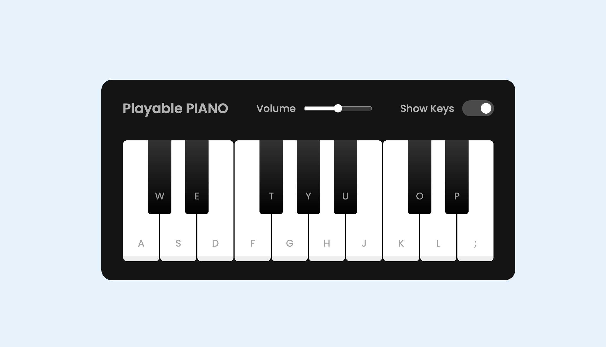

# 🎹 Playable Piano

I wanted to play the piano!
I didn't have a piano,
so I build one!!


A browser-based interactive piano you can play using your keyboard or mouse — built with HTML, CSS and JavaScript.



---

## 🎮 Demo

> Clone the repo, open `index.html` in your browser and start playing!

---

## ✨ Features

- 🎵 Play notes using your **keyboard keys** or by **clicking** the keys
- 🔊 **Volume control** via a slider
- 👁️ **Show/Hide key labels** toggle
- 📱 **Responsive design** — works on smaller screens too

---

## ⌨️ Keyboard Mapping

| White Keys | A | S | D | F | G | H | J | K | L | ; |
|------------|---|---|---|---|---|---|---|---|---|---|
| Black Keys | W | E | - | T | Y | U | - | O | P | - |

---

## 🚀 Getting Started

### 1. Clone the repo
```bash
git clone https://github.com/Danny6565/playable-piano.git
```

### 2. Open in your browser
```bash
cd playable-piano
open index.html
```

> No installs or dependencies needed — it runs straight in the browser.

---

## 📁 Project Structure

```
playable-piano/
│
├── index.html       # Main HTML structure
├── style.css        # Styling and layout
├── script.js        # Piano logic and keyboard events
└── tunes/           # Audio files (.wav) for each key
    ├── a.wav
    ├── s.wav
    └── ...
```

---

## 🛠️ Built With

- **HTML5**
- **CSS3** — including responsive media queries
- **Vanilla JavaScript**
- **Google Fonts** — Poppins

---

## 📄 License

[MIT](LICENSE)

---

> ⭐ If you like this project, give it a star!
